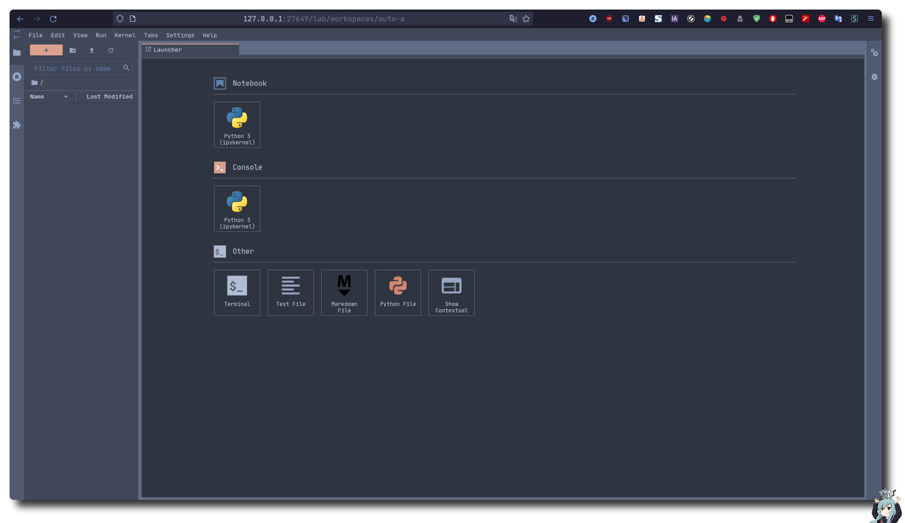
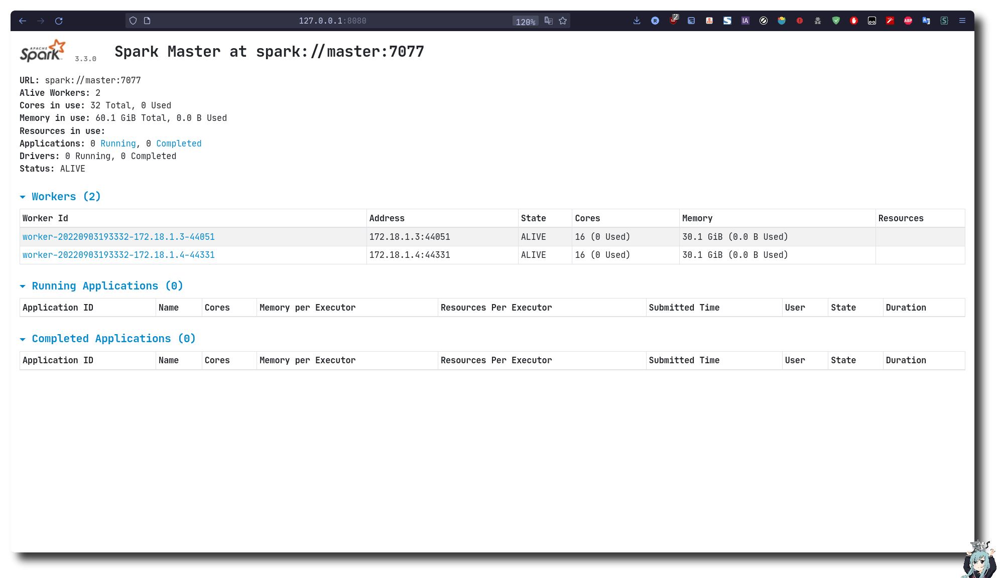
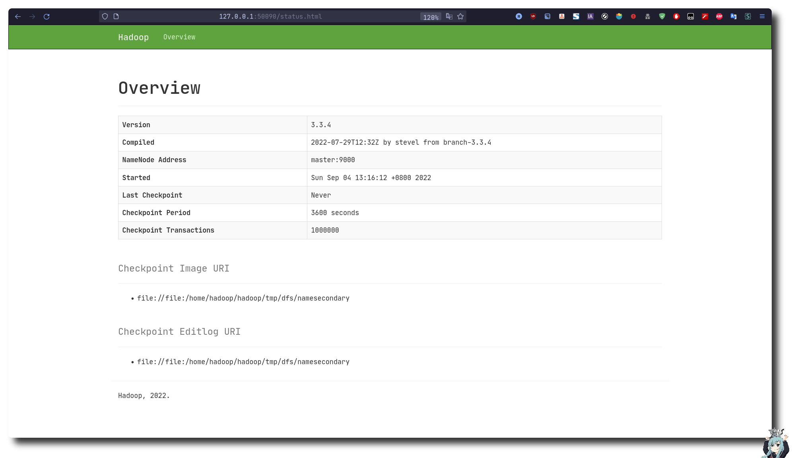
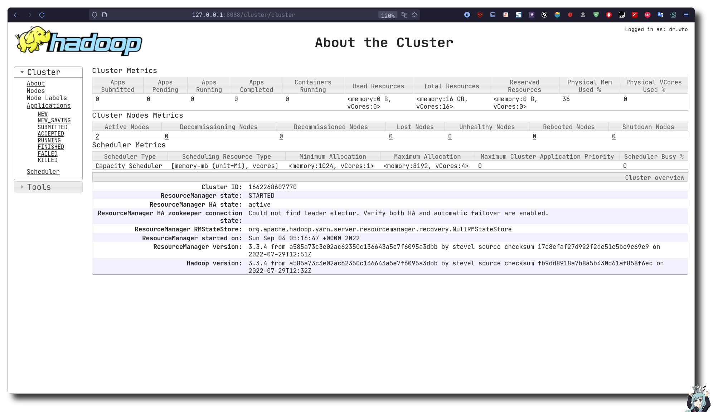

<h3 align="center">Hadoop+Spark 集群环境(一主两从)</h3>
<p align="center">实验环境和开发环境(python)均已集成</p>

*我个人的学习环境，随着学习深入，将不断改进......*

[](https://github.com/Ruixi-rebirth/docker-hadoop/actions)

### 环境详情
|名称|IP|说明|JDK版本|Hadoop版本|Spark版本|
|---|---|---|---|---|---|
|hadoop-master|172.18.1.2|Master节点|11.0.16|3.3.4|3.3.0|
|hadoop-slave1|172.18.1.3|Slave节点|11.0.16|3.3.4|3.3.0|
|hadoop-slave2|172.18.1.4|Slave节点|11.0.16|3.3.4|3.3.0|

- hadoop 部署说明: 完全分布式模式(集群模式), master 节点仅作为 NameNode 使用, slave 节点 为 DataNode
- spark 部署说明: Spark On YARN(*Yet Another Resource Negotiator, 另一种资源协调者*), 即 Spark 运行在 Hadoop YARN 框架之上的一种模式
- spark 和 hadoop 目录下的 sbin 中的 start-all.sh, stop-all.sh 重名了，我已经将 spark文件夹下的重命名为 start-all-spark.sh, stop-all-spark.sh 
- .ssh 文件夹里面的公钥和私钥可以自己本地生成，每个节点会得到一样的公钥和私钥，方便 ssh 免密登陆(~~各个节点之间公钥相互拷来拷去的，很麻烦😤~~)
- dockerfile 中的 hadoop.tar.gz 和 spark.tar.gz 压缩包是我修改过配置文件的 [下载地址](http://23.105.207.7:8888/)
- 各个节点之间 $HADOOP_HOME/etc/hadoop/ SPARK_HOME/conf 配置共享
- 各个节点已部署好 anaconda, master节点的 jupyterlab 端口也映射出来了, 在`docker compose up -d`启动容器的前提下, 直接浏览器打开 [127.0.0.1:27649](http:127.0.0.1:27649) 使用, 且 notebooks 目录的内容会同步到本地, 可在 jupyterlab 中使用 pyspark, 登陆密码设置可以进入 hadoop-master 容器,然后看这个[教程](https://jupyter-notebook.readthedocs.io/en/stable/public_server.html)改配置文件



### 截屏



### 使用 
1. 克隆仓库到本地
```bash
git clone https://github.com/Ruixi-rebirth/docker-hadoop.git
```
2. 后台启动容器 
```bash
docker compose up -d
```
3. 与容器进行交互
```bash
docker exec -it hadoop-master /bin/bash

docker exec -it hadoop-slave1 /bin/bash 

docker exec -it hadoop-slave2 /bin/bash
```
