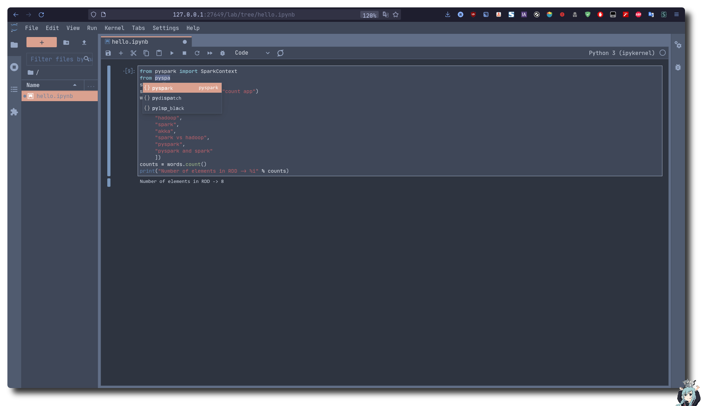

*我个人的学习环境，随着学习深入，将不断改进......*
#### Shot


1. 克隆仓库到本地
```bash
git clone https://github.com/Ruixi-rebirth/docker-hadoop.git
```

1. 下载必要的组件到context中

    点击此 [链接](http://23.105.207.7:8888/) 进行下载，下载到该项目根目录中

2. 后台启动容器 
```bash
docker compose up -d
```
3. 与容器进行交互
```bash
docker attach hadoop-master

docker attach hadoop-slave1

docker attach hadoop-slave2
```


